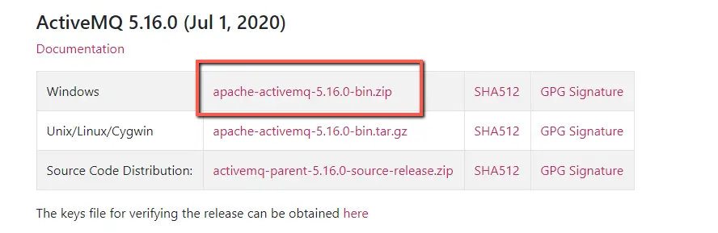
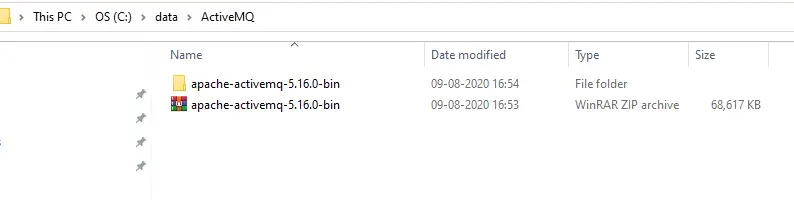
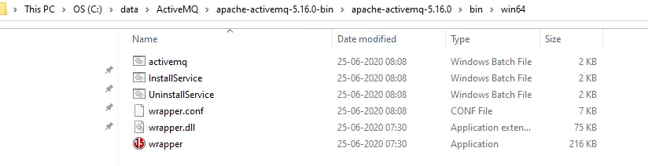
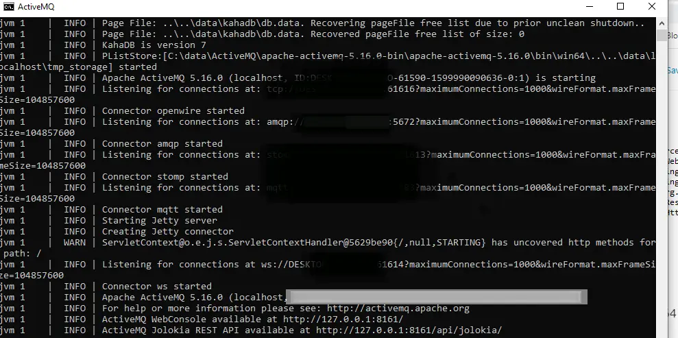
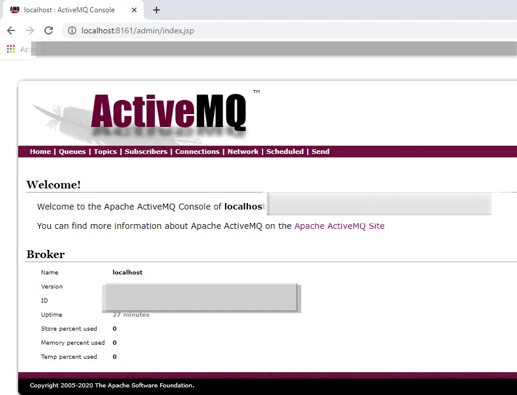

### Download, Install and start ActiveMQ.
Download and Install ActiveMQ.
Click on below link to download ActiveMQ.

http://activemq.apache.org/components/classic/download/

Download the zip file and extarct it.

Go to win64(or win32 depends on your machine) folder. For example.

- C:\Users\besta>cd C:\Users\besta\Downloads\apache-activemq-6.1.3-bin\apache-activemq-6.1.3\bin\win64\

Double click on activemq, our ActiveMQ should get started and we should able to see below screen.

Let’s login to ActiveMQ Console using below URL.

[http://localhost:8161/admin/](http://localhost:8161/admin/)

It will ask for username and password. Default username – admin and password – admin.

Once we provide username and password we should able to see below ActiveMQ console.

References: 
- reference1: https://github.com/Nurislom373/MessageBrokers/tree/master
- reference2: https://activemq.apache.org/components/classic/documentation/hello-world

### Start java applications 
- org.example.warehouse.Main
- org.example.centralservice.Main

### send UDP messages
prereq: have Nmap installed 

In terminal go to Nmap folder. For example:

 - cd C:\Program Files (x86)\Nmap>

Send udp messages using
* echo sensor_id=t1; value=30 | ncat -u -w1 127.0.0.1 3344
* echo sensor_id=h1; value=40 | ncat -u -w1 127.0.0.1 3355
